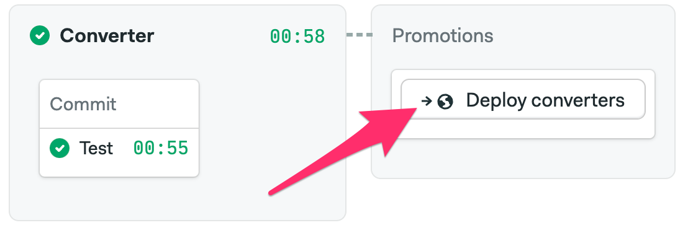

# converter approval

eagle.io development team should consider the following checklist when [approving a pull request](https://www.jetbrains.com/help/idea/work-with-github-pull-requests.html#apply-pull-request-changes):

- converter name should be a meaningful description of data origin
- converter should translate all data in the input format
- confirm tests pass locally, e.g. `npm run test` 
- confirm file names use `kebab-case`
- confirm class names use `UpperCamelCase`
- confirm logic is expressed cleanly and reads well

If the pull request is of sufficient quality it can be approved via Intellij or Github; otherwise, feedback can be provided via the pull request comments.

## Integrating a converter

- [add converter bindings](#adding-converter-bindings)
- confirm converter can be [invoked locally](#invoking-a-converter-locally)
- commit and push changes
- [deploy converters](#deploying-converters)

### Adding converter bindings

deployment of a `converter` requires bindings to be included by the approving staff member:

`index.ts` should define a function that invokes the new converter as follows:

```ts
export const sampleConverter = async (input: ConverterInput): Promise<ConverterOutput> => {
  return convert(new SampleConverter(), input)
}
```

| Variable          | Description                                                  |
|-------------------|--------------------------------------------------------------|
| `sampleConverter` | defines the lambda function entry point of the new converter |
| `SampleConverter` | defines the class name of the new converter                  |

`template.yml` should include a section defining a new lambda function as follows:
```yml
Sample:
  Type: AWS::Serverless::Function
  Properties:
    Description: Sample CSV
    Handler: index.sampleConverter
    Policies:
      - AWSLambdaBasicExecutionRole
    Tags:
      Scope: private
  Metadata:
    BuildMethod: esbuild
    BuildProperties:
      Minify: true
      Target: "es2020"
      Sourcemap: true
      EntryPoints:
        - index.ts
```

| Variable | Description |
|----------|-------------|
| `Sample` | defines the lambda function prefix (internal use only) |
| `Description` | defines the format name that will appear to users in the datasource wizard |
| `Handler` | provides a reference to the lambda entry point defined in `index.ts` |
| `Scope` | defines whether the converter will be visible to all accounts (`public`) or enabled via the admin console for a specific account (`private`) |

a converter should be considered `Scope: public` if the format origin is likely to be useful to the wider eagle.io community _and_ the implementation/testing is sufficiently robust to allow for all format permutations. `public` converters should demand a high degree of scrutiny as any changes could affect data ingestion for many accounts.

### Invoking a converter locally

converter functions are constructed using the [AWS Serverless Application Model](https://aws.amazon.com/serverless/sam/) and can be tested locally prior to deployment using the `aws-sam-cli`. SAM provides a method to invoke a converter in a local docker environment (`sam local invoke`), and `invoke.sh` is a convenience script to marshall data to a converter in the expected format.

```shell
sam build
./invoke.sh Sample lib/sample/test/input.dat
```

### Deploying converters

converters are tested on checkin and can be [deployed via CI](https://eagle-io.semaphoreci.com/projects/converter).



### Enabling private converters

`public` converters are automatically made available to users but `private` converters must be explicitly enabled on an account via the [admin console](https://app.eagle.io/admin/accounts).


